# Features

A tour of the feedback module: what it does, what it keeps from PL LabOS tools (where it was built), and
what the kit adds. Every screenshot was taken from `examples/next-app`, an invented bakery with
invented people, at 2× in Chromium, by `examples/next-app/scripts/screenshots.mjs`.

One change from PL LabOS tools applies throughout: **there is no Title field.** PL LabOS tools asked for an
optional title. The kit never asks. A title is generated on the server from the body, the page and the
screenshots, by an LLM when one is configured, and otherwise from the first sentence of the body
(see [SERVER.md](SERVER.md#6-titles)).

Contents:

1. [The button and its shortcut](#1-the-button-and-its-shortcut)
2. [The feedback panel](#2-the-feedback-panel)
3. [The automatic screenshot](#3-the-automatic-screenshot)
4. [More screenshots: whole page and pick a part](#4-more-screenshots-whole-page-and-pick-a-part)
5. [Annotating a screenshot](#5-annotating-a-screenshot)
6. [The description field](#6-the-description-field)
7. [Kind and priority](#7-kind-and-priority)
8. [Drafts](#8-drafts)
9. [Filing: journaled on the server, outbox in the browser](#9-filing-journaled-on-the-server-outbox-in-the-browser)
10. [The status mark](#10-the-status-mark)
11. [Keyboard](#11-keyboard)
12. [What is captured with a report](#12-what-is-captured-with-a-report)
13. [The issues page](#13-the-issues-page)
14. [The issue page](#14-the-issue-page)
15. [Reporter identity](#15-reporter-identity)
16. [Servers that must not file](#16-servers-that-must-not-file)
17. [Small things that matter](#17-small-things-that-matter)

---

## 1. The button and its shortcut

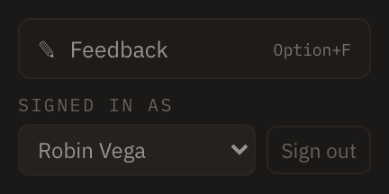

- **Feedback** (`FeedbackButton`) sits wherever the app puts it; in the example, in the footer of the
  navigation rail on every page, above the status line and the demo's "Signed in as". Put it in any
  fallback layout too (PL LabOS tools draws one when the server is too busy to draw navigation), so a
  report can be filed exactly when things are going wrong.
- **Alt+F** (Option+F on a Mac) opens it from anywhere. The match is on the physical key
  (`event.code === 'KeyF'`), because on macOS Option+F types `ƒ`. The shortcut does nothing while
  the focus is in a text field, during IME composition, on key repeat, or when another dialog is
  open.
- The button carries `aria-keyshortcuts="Alt+F"`. The small `Option+F` hint inside it is hidden
  normally and appears only while the app's keyboard-shortcuts list is open, so the rail stays
  quiet.
- The shortcut is configurable (`shortcut` on `FeedbackProvider`), and `openFeedback()` opens the box
  from any control of the app's own.

## 2. The feedback panel

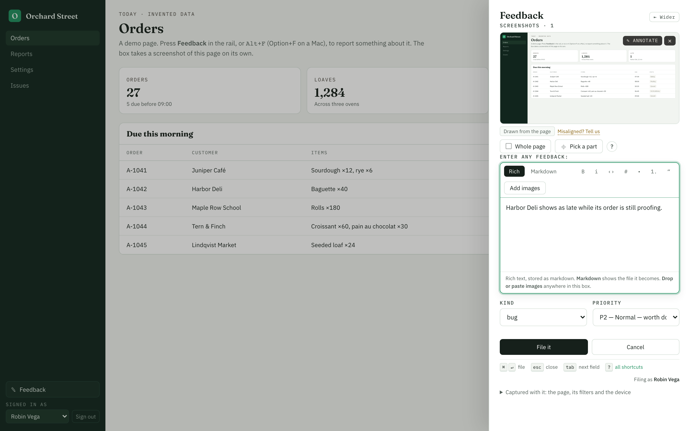

The panel is a drawer on the right, 420 px wide, over a dimmed scrim. On a phone it takes the
full width. From top to bottom:

- **Header:** the panel's own heading, "Feedback" (an `<h2>`, set larger than the other labels), a
  **Drafts · N** button when unsent drafts from other pages exist ([8](#8-drafts)), and
  **Wider / Narrower**. There is no intro sentence — the fields speak for themselves, and filing
  saves it on the server at once, or keeps it in the browser if the server cannot be reached.
- **Screenshots** ([3](#3-the-automatic-screenshot), [4](#4-more-screenshots-whole-page-and-pick-a-part)).
- **Enter any feedback:**, the description field ([6](#6-the-description-field)).
- **Kind** and **Priority** ([7](#7-kind-and-priority)).
- **File it** and **Cancel**, a one-line key hint (`⌘↵ file · esc close · tab next field · ? all
  shortcuts`), and a folded **Captured with it** section ([12](#12-what-is-captured-with-a-report)).

**Wider** turns the drawer into a two-column layout, up to 1120 px or 80% of the window, with the
screenshots on the left and the text on the right, for a report that has grown long. The choice is
remembered in this browser only (localStorage).

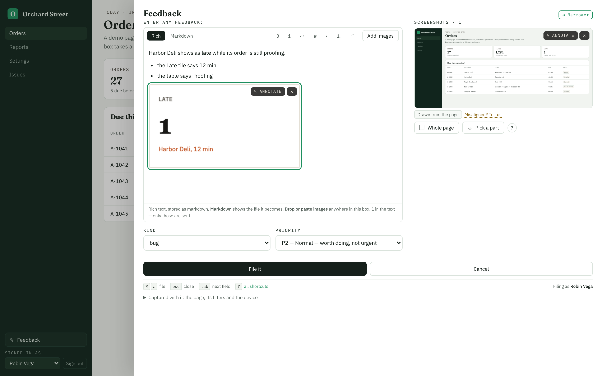

The drawer and everything it opens are portalled to `<body>`, so a sticky rail's stacking context
cannot paint over them. Every part of it carries the class `nocapture`, which keeps it out of its own
screenshot.

## 3. The automatic screenshot

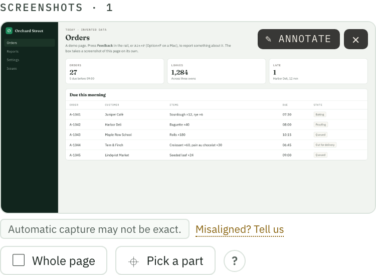

When the panel opens, it takes a screenshot of the current viewport by itself: no button, no
permission prompt. It is a **redraw**: the page's DOM cloned into an SVG `foreignObject` and
rasterised by the browser (the `modern-screenshot` library). Because it is a redraw, it can leave
things out, and it does: everything marked `nocapture` (the panel, the scrim, the status popover) is
dropped, so the picture shows the page as it was before the panel covered it.

- It is labelled **Automatic capture may not be exact.**.
- **Aim: pixel perfect.** In PL LabOS tools it differs from the browser's own screenshot on about 0.05%
  of pixels (anti-aliasing), at the top of a page and scrolled. Getting there took self-hosted
  fonts, a zeroed body margin, sticky and fixed elements moved back to where they are on screen,
  and no phantom scrollbars ([REBUILD.md](REBUILD.md#5-the-capture-pipeline)).
- **Ask people to say when it is wrong** (the kit's version of PL LabOS tools' "Mis-aligned?" hint).
  Under every automatic capture is a dotted **Misaligned? Tell us** toggle. Its tooltip says the
  capture is a redraw that can get spacing, wrapping or a form control subtly wrong, and that
  **Whole page** or **Pick a part** take the exact pixels instead. Pressing it marks the screenshot
  (it reads **Misaligned · noted**), thanks the reporter, and records the flag with the report
  (`context.capture.misaligned`), so a bad capture arrives as evidence about the capture.

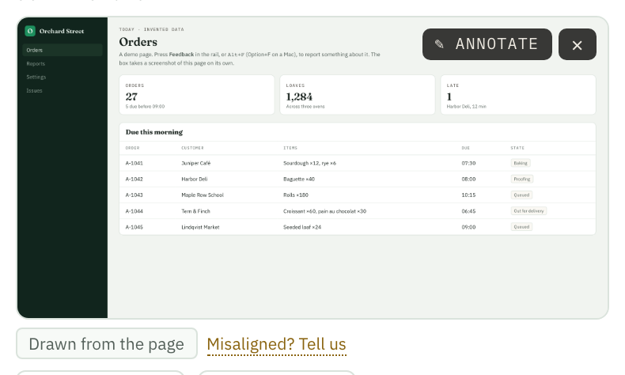
- If the redraw fails or takes more than 12 s, nothing is added and nothing is said: it was never
  asked for. The report files without a screenshot.
- Each screenshot has **✎ Annotate** and **×** (delete) in its top-right corner. Clicking the
  picture also opens the annotator.

## 4. More screenshots: whole page and pick a part

Below the list are two buttons. Both **add** a screenshot; neither replaces one, because a second
picture is a second piece of evidence and one already annotated must not vanish.

- **▢ Whole page** asks the browser for its own screen capture (`getDisplayMedia`, pre-selecting
  this tab in Chromium). It is exact, it shows a permission prompt every time, and it cannot redact
  anything: the panel is hidden while it runs, and whatever else is on screen is in the picture.
  It is labelled **Captured from your screen**.
- **⌖ Pick a part** hides the panel and puts a crosshair surface over the page. Drag a rectangle; its
  size shows above it in CSS pixels.

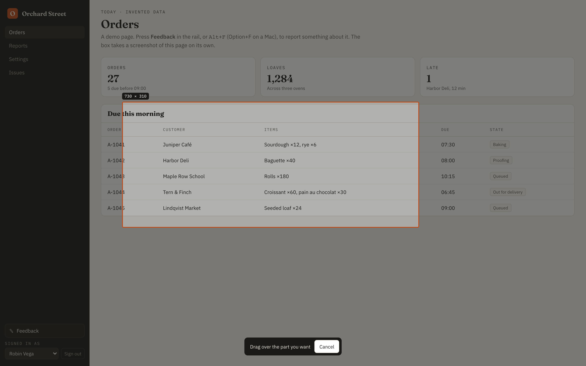

Beside the two buttons, a small **(?)** carries what used to be a paragraph under them: that a
screenshot is optional (or, once there is one, that the buttons add rather than replace), that both
use the browser's own screen capture for exact pixels where it can and will ask permission, and that
clicking a screenshot annotates it while its **×** deletes it. It shows on hover or keyboard focus,
so the panel stays quiet until someone asks.

With a **mouse**, letting go takes the picture. With a **finger or a pen**, letting go leaves the
rectangle up with four corner handles (44 px touch targets around a 14 px dot). Drag a corner to
resize, drag inside to move, draw outside to start again, then press **Use this part** (or Enter).
The bar with the instructions moves to the top when the selection reaches down into it.
**Cancel** or Esc leaves.

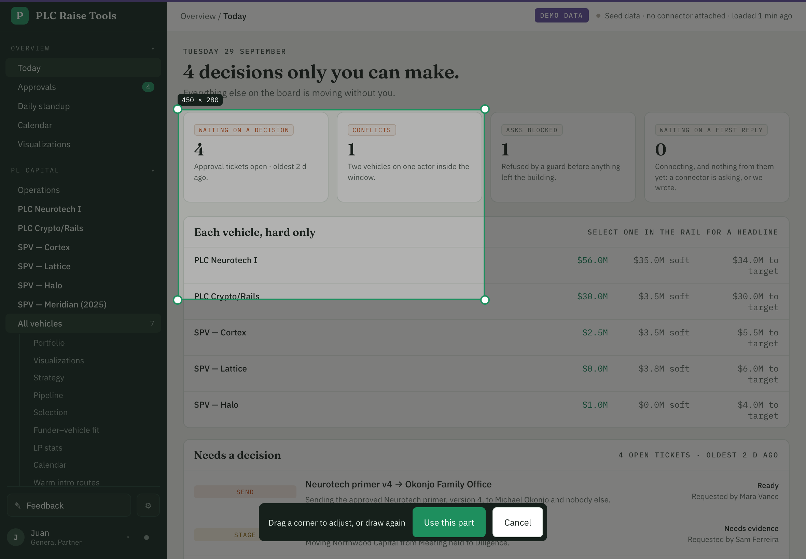

The surface claims every touch (`touch-action: none`, and `touchmove` and Safari's `gesture*`
events cancelled), so a drag never scrolls or zooms the page. If the browser takes the pointer back
anyway (`pointercancel`), the selection returns to what it was before that drag. A drag smaller than
8 px on either side counts as a mis-tap.

The region is then cut from the screen capture, measuring the captured frame rather than assuming
`devicePixelRatio`. If the person shared a window or a screen instead of this tab (the frame is not
the viewport's shape), the region is drawn from the page instead, and the screenshot's note says so.
If the screen capture is declined, unsupported or too slow, the kit falls back to the redraw rather
than leave the person with nothing; if that fails too, a line says "No capture came back — declined,
unsupported, or it took too long. Everything else still files."

## 5. Annotating a screenshot

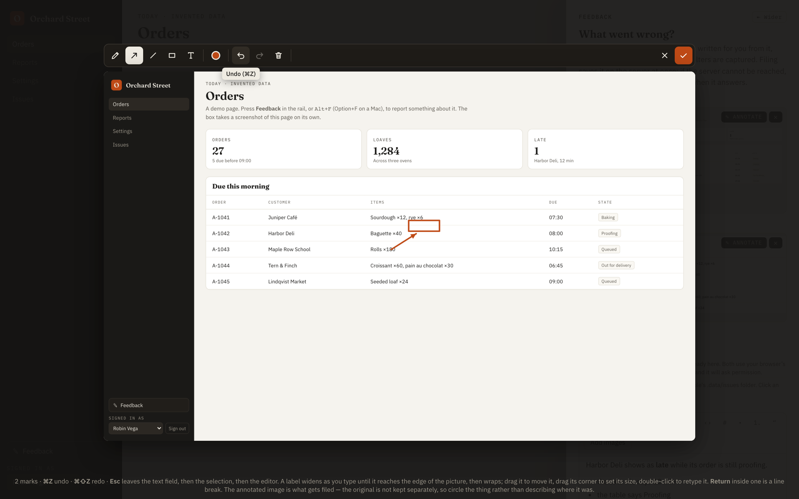

**Annotate** opens a full-screen editor over the picture:

- Tools: select, freehand pen (the default), arrow, line, box, text label, and crop.
- **Crop**: drag the part of the picture to keep; what it leaves out is dimmed. Drag inside the crop
  to move it, drag elsewhere for a new one, click outside it to keep the whole picture again. Undo
  and Redo take it back and forth like a mark. Nothing is cut until **Done**, so marks outside the
  crop can still be dragged in; the saved picture is the crop's size.
- **Select** (the pointer) is also the way out of another tool. Click a mark to select it (a dashed
  outline, never saved); drag to move it; **Delete** or **Backspace** removes it; a color or stroke
  width picked while it is selected applies to it. Esc deselects.
- One **Color and stroke width** button: five colors (clay, green, purple, ink, white), a color
  picker, an eyedropper where the browser has one (Chromium's `EyeDropper`; the button is not drawn
  elsewhere), and four stroke widths (thin, medium, thick, heavy) for the pen, lines, arrows and
  boxes. They share a button so the row still fits a phone.
- Text labels are real elements while editing: type (Return is a new line), drag to move, drag the
  corner to set a wrap width, double-click to retype. Size is in pixels of the saved image, 8–400,
  typed or picked from presets. Bold on by default.
- Undo (⌘Z), Redo (⌘⇧Z or ⌘Y), Clear, Cancel and Done. A status line counts the marks.
- **The toolbar is one row of icon buttons** (a kit change; PL LabOS tools used words). Each has an
  accessible name and a dark tooltip with its shortcut, shown on hover and keyboard focus and always
  drawn above the picture; the active tool
  is marked as well as announced (`aria-pressed`). On a phone the row fits the screen with 44 px
  targets.

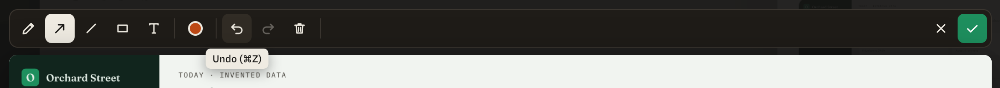
- **The annotated image replaces the original**; the original is not kept. The screenshot is then
  flagged **annotated**.

Images dropped into the description can be annotated the same way ([6](#6-the-description-field)).

## 6. The description field

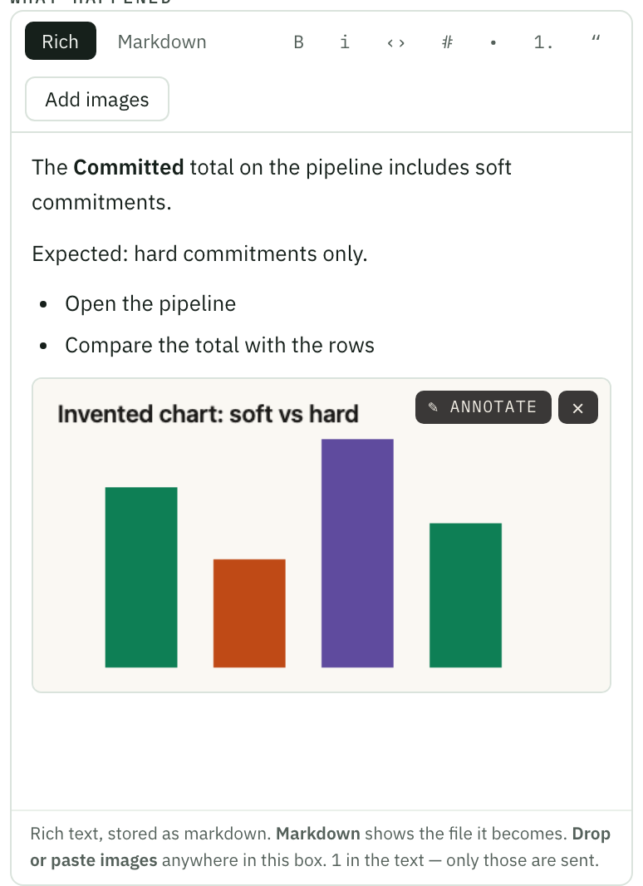

The description is a WYSIWYG markdown editor (TipTap with `tiptap-markdown`):

- **A focus ring on the whole field**, not just the textarea, in the theme's accent colour (PLC green,
  `--fbk-accent`, by default): the border and a soft glow appear the moment the cursor is inside it —
  rich or markdown, dropped image or typed text — so the eye goes straight to where you type.
- **Rich** is the default: bold, italic, code, heading, bullet and numbered lists and quote from the
  toolbar or with markdown shortcuts as you type (`**bold**`, `- ` for a list).
- **Markdown** shows the source, which is exactly what will be stored. While the Markdown tab is
  open, the textarea is the document: nothing reformats what you type.

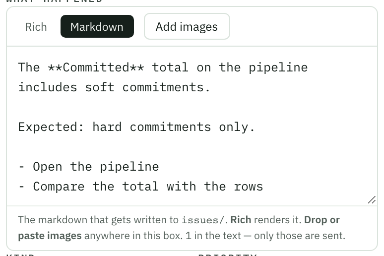

- **Images:** drop files anywhere in the box, paste them from the clipboard, or use **Add images**
  (multiple files). PNG, JPEG, GIF and WebP up to 8 MB each; anything else is refused with a line
  saying what and why, and the rest go in. Each image appears inline with its own **✎ Annotate** and
  **×**.
- Images are stored in the text as ``, never as data URLs. The server names the
  files and rewrites the references.
- **Only the pictures still in the text are sent.** Delete an image from the text and it is not
  uploaded; the rest are renumbered to match. The hint under the field says "N in the text — only
  those are sent."
- While images are being read, a "Reading images…" line shows and **File it** waits.
- `<`, `>` and `&` are stored as typed, not as HTML entities.

## 7. Kind and priority

Both optional, with PL LabOS tools' defaults.

- **Kind:** bug (default), request, question, chore.
- **Priority:** P0 Blocking (nobody can work around this), P1 Serious (there is a workaround and it
  hurts), P2 Normal (default; worth doing, not urgent), P3 Someday (a good idea with no clock on it).
  Each meaning is spelled out right in the priority dropdown's own options, so it travels with the
  choice instead of sitting in a paragraph underneath. No date is promised against a priority: how
  fast anything is fixed depends on how full the queue is, which the issues page shows. (An earlier
  version promised "fixed in 1–2 days" for P0, which taught people to file everything as P0.)

In practice almost every report arrives as bug/P2. Triage should not rely on them
([TRIAGE.md](TRIAGE.md)).

## 8. Drafts

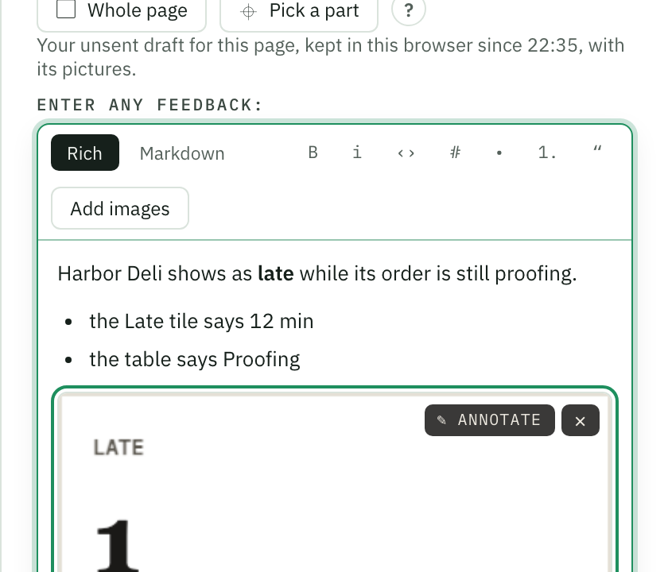

Nothing typed is lost to a reload, a crash or a closed tab.

- A draft is **per page**: it is named by the route it was started on. Opening the panel on a page
  with a draft restores it, with a line saying it is your unsent draft for this page and since when.
- Words (body, kind, priority) are saved to localStorage on every change. Pictures (screenshots,
  annotated or not, and dropped images) are saved to IndexedDB under the same page, because two or
  three of them exceed what localStorage holds.
- A draft exists only when there is something worth keeping: words, an annotated screenshot or a
  dropped image. The automatic screenshot alone is not a draft.
- **Drafts · N** lists unsent drafts started on other pages, newest first, with the page, the time
  and the picture count. Picking one loads it into the panel, pictures and all (the one in the panel
  is kept). It is then filed with the current page and records the page it was started on.
  **Discard** asks first.

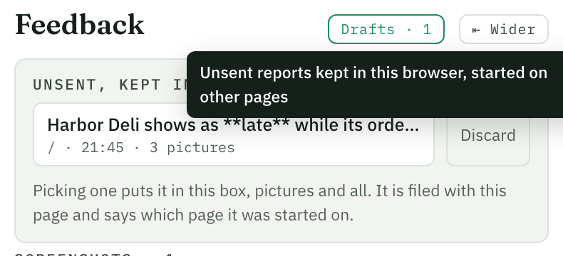

- Filing drops the draft only after the report is safely kept (in the outbox or on the server).
- Every storage call may fail (a private window, storage off). A failure means the draft is not
  kept; it never breaks the panel.

## 9. Filing: journaled on the server, outbox in the browser

**File it** (or ⌘/Ctrl+Enter) returns at once: nothing waits on the server. The panel stays open on
a **filed screen** that says where the report stands: "Sending…", "Saved on the server · being
filed", "Kept in this browser (reason) · sent again when the server answers", "Refused by the
server: reason", and **Filed as issue N** once the number is known, with a thank-you line. Three
buttons: **Give more feedback** (focused; also ⌘/Ctrl+Enter) gives a fresh box on the same page with
a new automatic screenshot; **Open the issue** links to it once it has a number; **Close** (also
Esc). From the second report on, a list under them, "Filed while this was open · N", has a row per
report, linked once numbered.

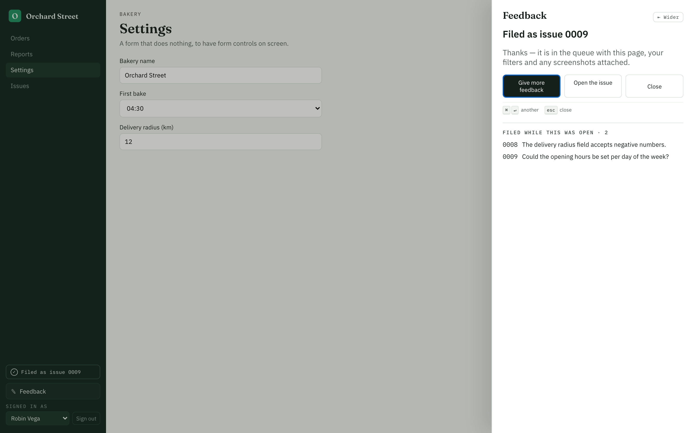

Behind File:

1. The report goes into this browser's **outbox** (IndexedDB, one record per report, pictures
   included) under a fresh **client id**, the idempotency key.
2. It is posted at once with a short timeout (3 s, plus 1 s per MB of pictures, at most 20 s).
3. The server validates it, **writes it to a journal file on disk** (atomically), and answers 202.
   It does not wait for the database, for numbering, or for anything else. The browser then drops
   its copy: the report is safe on the server, and the tab can be closed.
4. A background ingester on the server files the journal entry as an issue a moment later
   (numbering, attachments, database row). The browser asks the journal where it stands and shows
   **Filed as issue 0024** when it is.

When the server cannot be reached (restarting, frozen by a long import, offline), the report stays
in the outbox, **only on this device**, and a sender resends it on its own: after 5 s, 15 s,
60 s, then every 2 minutes, and at once when the page loads, the network comes back, the tab is
shown again, or any other request to the app succeeds. Resends are safe: the server files one issue
per client id however often it is sent.

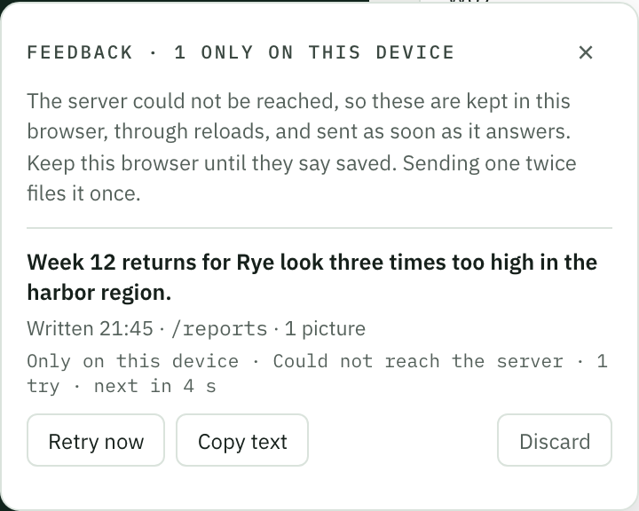

The outbox list shows each waiting report with its first line, when it was written, its page, its
picture count, its state ("Could not reach the server · 1 try · next in 4 s") and three actions:

- **Retry now** sends it immediately, even one the server refused.
- **Copy text** copies the title line, body, kind, priority, page and time, enough to file it by
  hand if everything else fails. It works on plain http too (falls back to a selection copy).
- **Discard** drops it after a confirmation.

A 4xx answer (too large, not an image) marks the report **refused**: it waits for Retry now instead
of retrying on the clock, and shows the server's reason. If IndexedDB is unavailable, the words are
kept in localStorage without the pictures, and the entry says so. Tabs tell each other about
changes, so two open tabs show the same outbox.

Only when neither the browser nor the server could keep it does the panel stay open, with "Not
saved", the reason, and the draft intact.

## 10. The status line

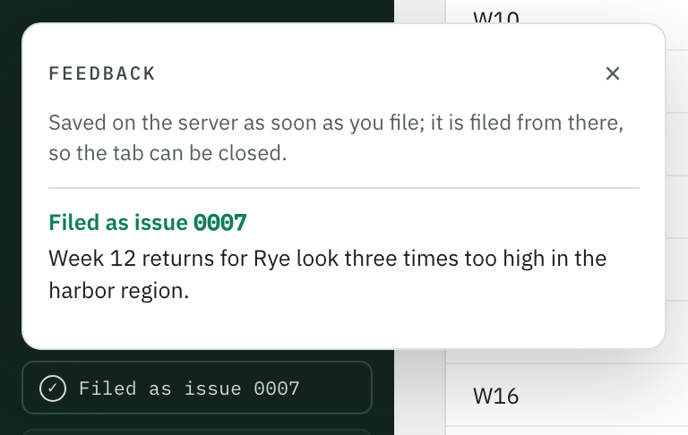

`FeedbackStatus` is a small line in the rail (or a bar) that says where filed feedback stands, most
urgent first, in a glyph and words:

| Glyph | Words | Meaning |
|---|---|---|
| `!` | "1 report only on this device" | Not yet safe to close the tab. `×` when the server refused one. |
| `↑` | "Saving…" | Sending now. |
| `✓` | "Saved on server · filing…" | Safe on the server; the issue is being filed. |
| `✓` | "Filed as issue 0024" | Filed (shown for a few seconds). |
| — | — | Nothing to say: the line is not drawn. |

A click or tap (not a hover, for touch screens) opens the outbox list. Colour is never the only
signal; the glyph and the words differ, and changes are announced (`aria-live="polite"`). PL LabOS tools
used a single mark with a popover in between, and its mark also reported background imports; the
kit's line covers feedback only.

## 11. Keyboard

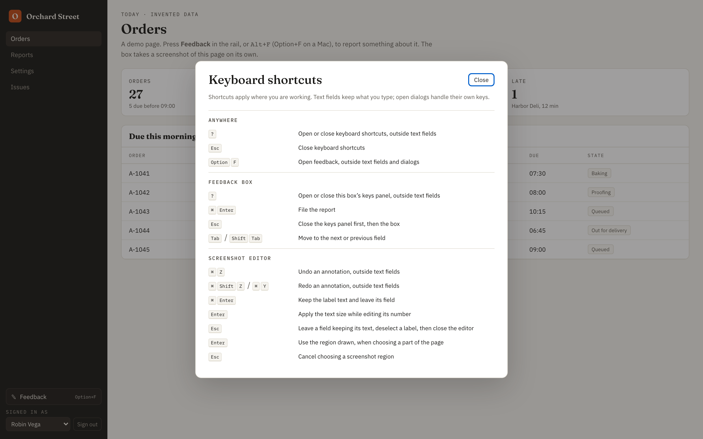

- **Alt/Option+F** opens the panel (outside text fields and dialogs).
- **⌘/Ctrl+Enter** files, from anywhere in the panel, including inside the description. On the filed
  screen it means **Give more feedback**, never filing again.
- **Esc** closes the keys panel first, then the panel. An open annotator or region picker takes Esc
  first.
- **Tab / Shift+Tab** move between fields.
- **?** (outside text fields) opens the panel's own keys card; in the rest of the app it opens the
  full shortcuts list. The panel's card and the app-wide list are rendered from the same data, so they
  cannot drift.

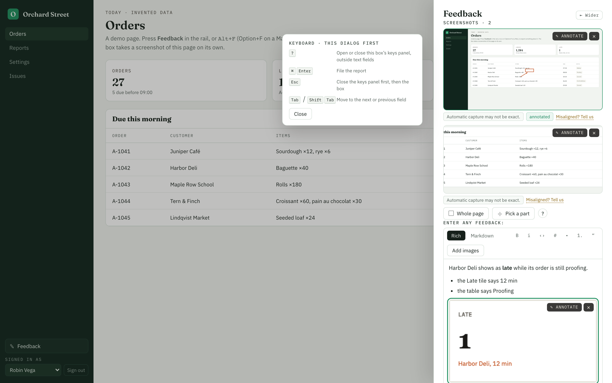

## 12. What is captured with a report

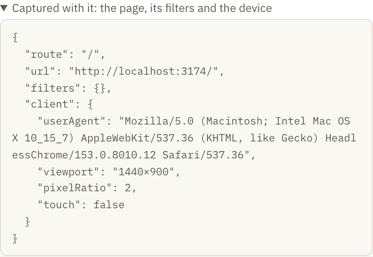

Folded at the foot of the panel, open on demand: the route, the full URL, the query-string filters,
the page the draft was started on (when different), and the device: user agent, viewport
(`1440×900`), `devicePixelRatio`, and whether it has touch. This is what lets a layout bug be
reproduced on the device it was seen on. It is sent as `context` and written into the issue.

## 13. The issues page

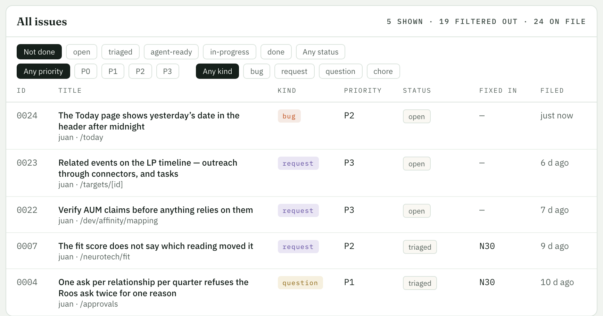

`IssuesPage` lists every issue (in PL LabOS tools, **Developer → Issues**):

- Four counts at the top: open issues at P0, P1, P2 and P3, each with what it means.
- An **issue velocity** chart: filed and closed per day for the last 30 days, and the open count,
  with a range where closure dates are missing, plus the same numbers as a table.
- Filters as toggle chips: status (Not done by default, each status, Any status), priority and kind.
  The header says how many are shown, how many the filters hid, and how many are on file. Filtering
  runs in the browser.
- Columns: id, title (with reporter and page under it), kind, priority, status, fixed in (links to
  the changelog entry), and filed (relative time).
**The kit adds**, beyond PL LabOS tools:

- **Local search.** A search box (focused with `/`) that filters as you type over id, title, body,
  reporter, page and labels, from an index built once in the browser. No request per keystroke. Search
  combines with the chip filters, and the header counts what it hid.

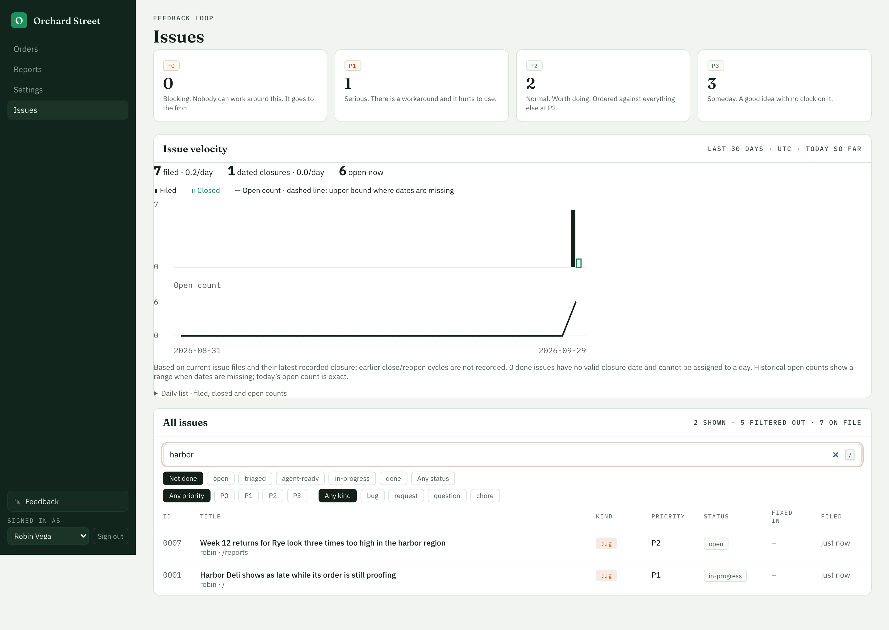

- **Status changes from the page.** PL LabOS tools edits status in the issue file; the kit adds a status
  control on the issue page (open, triaged, agent-ready, in-progress, done) that PATCHes the store,
  keeps unmanaged fields, and records `closed_at` when an issue is closed. The server's `authorize`
  hook decides who may; the example lets any signed-in demo user.

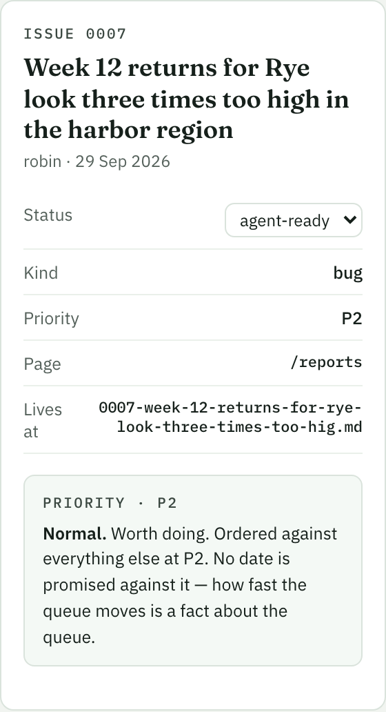

## 14. The issue page

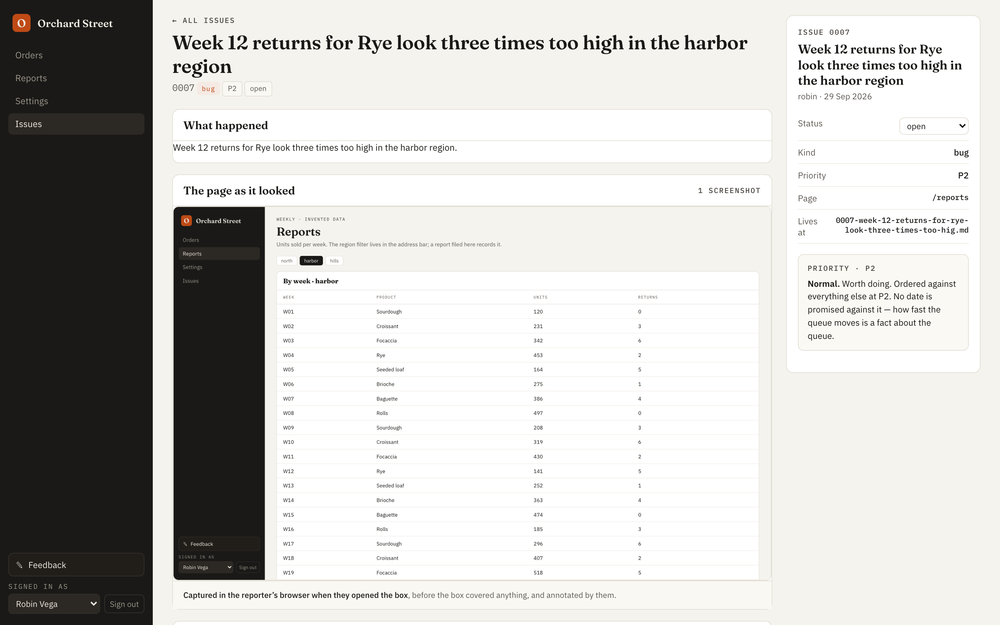

- The title (generated, in the kit), kind, priority and status.
- **What happened**: the body, rendered by the same markdown renderer the panel previews with, with
  dropped-in images resolved to their stored files.
- **The page as it looked**: every screenshot, full width.
- **Context at the moment it was filed**: the captured JSON.
- A sidebar: reporter, date, status, kind, priority, page, where the issue lives (a file path, or a
  URL for GitHub), the priority's meaning, and **Fixed in** with a link when a fix version is recorded.

## 15. Reporter identity

The reporter is never taken from the request body. The server captures the session's user when the
report arrives (the app's `resolveReporter(req)`) and can resolve it to a known user before the issue is
written (the ingester's `identify`). If the lookup fails, the
report waits in the journal and is retried; `unknown` is written only when a successful lookup finds no
user. The issue's context records how the reporter was established. In the example, a report filed
while signed out is filed as `unknown`; reading issues needs a sign-in.

## 16. Servers that must not file

Issue numbers are taken in filing order, so only one server may number them. In PL LabOS tools a
development checkout's server shows a different panel, "Feedback is filed from the live app", with a
link to the live app, and its route refuses reports with 403. The kit exposes this as a server option:
a server that does not file answers 403 with a sentence, and the client shows it.

## 17. Small things that matter

- **Plain http on a local network works.** `crypto.randomUUID` and the async clipboard exist only in
  secure contexts; the kit falls back to `crypto.getRandomValues` and a selection copy.
- **A capture can give up.** Every capture races a 12 s timeout, and the panel always comes back:
  it is never left hidden behind a capture that never returns.
- **Small reports survive the tab closing mid-send**: bodies under 60 KB are sent with `keepalive`.
- **A backslash at the end of a line** (a terminal habit for typing a newline) is removed, not filed.
- **The default theme is PLC green** (`--fbk-accent: #1E8F5E`, a green rail), not PL LabOS tools'
  clay. Every colour is a `--fbk-*` CSS variable, so a host app re-skins it in its own stylesheet or
  through `FeedbackProvider`'s `theme` prop — see the client README's
  [Theming](../packages/feedback-react/README.md#theming) section.
- **Safari on iPad**: the rail height uses `innerHeight` rather than `100dvh`, IndexedDB opens are
  given 2 s before falling back, and connections are opened per transaction, because Safari drops long
  held ones.
